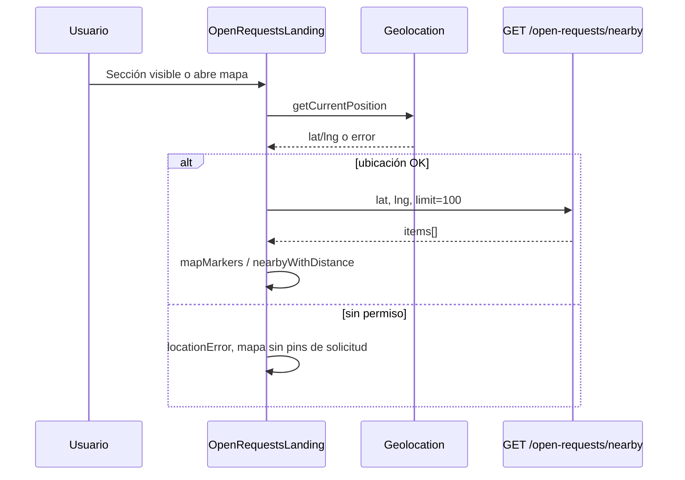

## Contexto

- **Hoy:** `OpenRequestsLanding` usa `REQUEST_MARKER_OFFSETS`, marcadores `demo-*` y `items()` del listado paginado por relevancia (máx. 8 offsets) para simular cercanía. La geolocalización del usuario ya funciona vía `navigator.geolocation`.
- **Modelo:** `open_requests` solo tiene `location_label` (texto). No hay `lat`/`lng` ni endpoint de proximidad.
- **Visibilidad:** “Abierta” = registro con `deleted_at IS NULL` (soft delete). No hay campo `status` adicional.

## Objetivos

1. Marcadores del mapa = solicitudes reales devueltas por API con coordenadas persistidas.
2. Máximo 100 marcadores iniciales por consulta nearby.
3. No inventar coordenadas en front ni geocodificar en caliente sin servicio existente.

## API

### `GET /open-requests/nearby` (público)

| Parámetro | Tipo | Obligatorio | Notas |
|-----------|------|-------------|-------|
| `lat` | number | sí | Latitud del usuario (-90..90) |
| `lng` | number | sí | Longitud del usuario (-180..180) |
| `limit` | number | no | Default `100`, max `100` |
| `radiusKm` | number | no | Default `50` (acotar búsqueda en SQL) |

**Respuesta 200:**

```json
{
  "items": [
    {
      "id": "uuid",
      "excerpt": "string",
      "tags": ["string"],
      "locationLabel": "string",
      "locationLat": 0.0,
      "locationLng": 0.0,
      "distanceKm": 1.2,
      "publishedAtLabel": "string",
      "budgetLabel": "string",
      "imageUrl": "string",
      "imageAlt": "string"
    }
  ]
}
```

- Orden: `distanceKm` ascendente.
- Excluir: `deleted_at` no nulo; `location_lat` o `location_lng` nulos.
- `distanceKm` calculado en servidor (Haversine), redondeo a 1 decimal en DTO.

**Errores:** `400` si `lat`/`lng` inválidos; `500` estándar.

### Persistencia

Migración agrega a `open_requests`:

- `location_lat` `double precision` nullable
- `location_lng` `double precision` nullable

Índice compuesto parcial opcional `(location_lat, location_lng) WHERE deleted_at IS NULL` para Postgres.

`POST /open-requests` y `PATCH /open-requests/:id` aceptan opcionalmente `locationLat` y `locationLng` (validar rangos). Si no se envían, columnas quedan `NULL` (la solicitud no sale en nearby).

### Consulta de proximidad

- Implementar en repositorio TypeORM con fórmula Haversine en query (Postgres/SQLite según `DB_TYPE`).
- Filtrar `deleted_at IS NULL`.
- `LIMIT` = min(`limit`, 100).

## Frontend

### Flujo



### Cambios en landing

- Eliminar `REQUEST_MARKER_OFFSETS`, `demo-*`, `PREVIEW_PIN_POSITIONS` basados en offsets (preview puede usar posiciones fijas solo para layout visual **sin** implicar coords geográficas, o ocultar pins de solicitud hasta tener nearby).
- Nuevos signals: `nearbyItems`, `nearbyState` (`idle` | `loading` | `success` | `error` | `empty`).
- `mapMarkers`: user pin + un marcador por ítem nearby con `lat`/`lng` del API (dedupe por `id`).
- `nearbyWithDistance`: derivado de `nearbyItems` (usar `distanceKm` del API).
- Listado principal (`GET /open-requests` relevancia) **sin cambios** de contrato.

### `RequestsMapComponent`

- Extender `RequestsMapMarker` con campos opcionales: `openRequestId`, `excerpt`, `tags`, `distanceKm`, `detailUrl`.
- Tooltip/popup Leaflet con datos reales; click en popup navega a `/solicitudes/:id` (mismo patrón que cards).

### Estados UX

| Condición | Comportamiento |
|-----------|----------------|
| Obteniendo ubicación | “Obteniendo tu ubicación…” (existente) |
| Permiso denegado | Mensaje claro; sección lista/map sin solicitudes simuladas |
| Cargando nearby | Indicador en sección y/o modal |
| Nearby vacío | “No hay solicitudes abiertas cerca de tu zona” |
| Error API nearby | Mensaje + reintentar |
| Listado global vacío | Empty state existente (independiente) |

## Decisiones

| Decisión | Alternativa rechazada | Motivo |
|----------|----------------------|--------|
| Endpoint dedicado `/nearby` | Extender `GET /open-requests` con `lat`/`lng` | No rompe paginación/relevancia del listado principal |
| Coords nullable en BD | Geocodificar `locationLabel` al vuelo | No hay servicio de geocoding en el proyecto |
| Haversine en SQL | Ordenar en memoria tras traer todo | Escala con límite 100 y radio |
| Sin coords → no marcador | Inventar offset en front | Requisito explícito del producto |

## Riesgos y mitigación

- **Datos históricos sin coords:** mapa vacío de solicitudes hasta que se publiquen con coordenadas o se backfill manual. Documentar en tasks; seed dev puede asignar coords a filas de prueba.
- **Privacidad:** solo se envían lat/lng del usuario al consultar nearby (HTTPS); no persistir ubicación del visitante en servidor en esta fase.

## Non-goals

- Geocodificación batch de `locationLabel`.
- Clustering de marcadores o mapa a pantalla completa distinto del modal actual.
- Filtros de mapa por categoría (reutilizar filtros globales en fase posterior).
